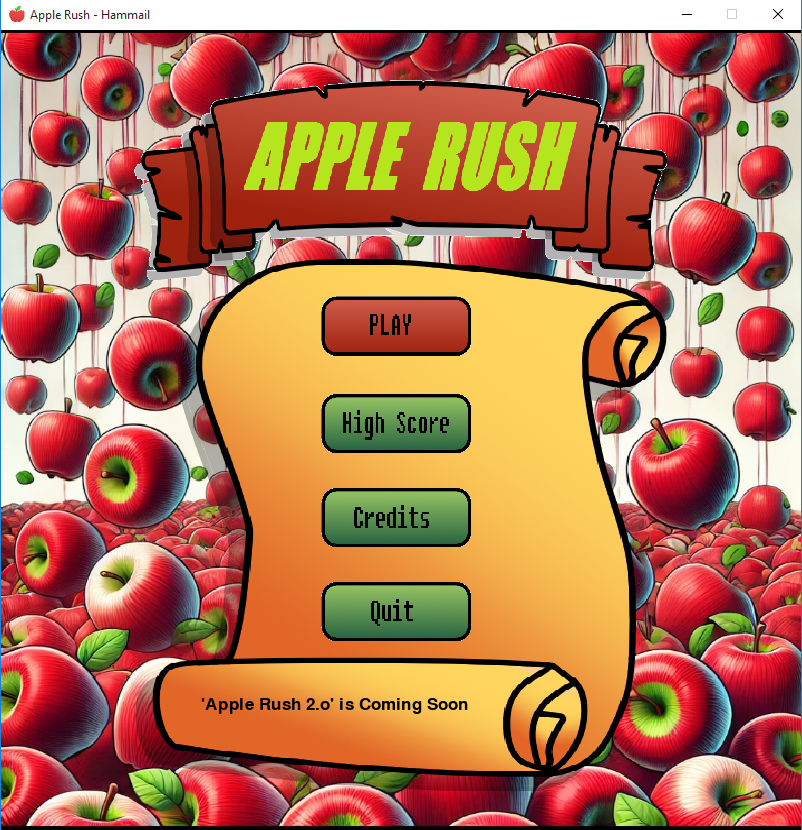
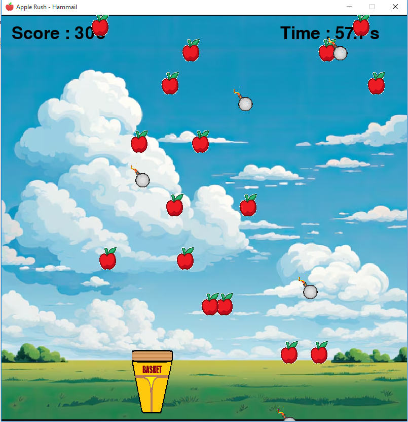
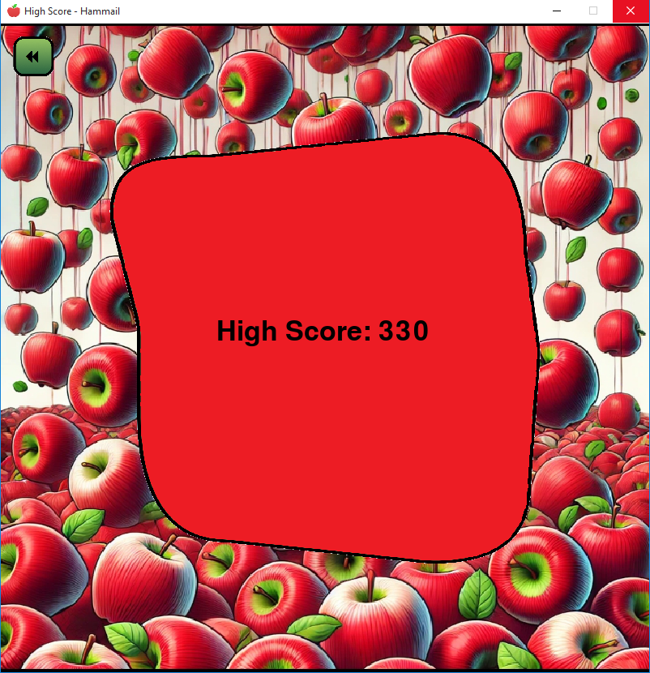

# 🍏 Apple Rush - A Pygame Adventure 🚀

> A fast-paced arcade game where you catch falling apples while dodging bombs!  
> Built with Python and Pygame, featuring dynamic difficulty, sound effects, and high-score tracking.
---

## 🎮 Features

### ✔ Score System
- **+5** points per apple 🍎  
- **-10** points per bomb 💣 (score never goes below 0)

### ✔ Dynamic Difficulty
- Apples/bombs spawn faster over time ⏳  
- Max **15 apples** on screen at once

### ✔ Immersive Experience
- Background music 🎶  
- Sound effects (apple catch, bomb explosion) 🔊  
- Clean UI with interactive buttons 🖱️

### ✔ Data Persistence
- High score saved in `high_score.txt` 🏆

### ✔ Responsive Controls
- Move basket with **LEFT/RIGHT** arrow keys ← →

---

## ⚙️ Installation

### Prerequisites
- Python 3.6+
- Pygame library

### Steps

Clone the repo:
```bash
git clone *Repo URL*
cd *Repo name*
```

Install dependencies:
```bash
pip install pygame
```

Run the game:
```bash
python game.py
```

> No additional assets needed—everything is bundled!


---

## 🕹️ Complete Game (No Python needed)

1. Navigate to Game folder.
2. Click **Apple Rush - Hammail.exe** to start the game.

### Controls
- ← or → arrow keys to move the basket

### Goal
- Catch **apples (green)** for points
- Avoid **bombs (black)** to prevent score loss

> Game ends when you close the window.

---

## 🕹️ How to Play

1. Launch the game to see the main menu.
2. Click **PLAY** to start.

### Controls
- ← or → arrow keys to move the basket

### Goal
- Catch **apples (red)** for points
- Avoid **bombs (gray)** to prevent score loss

> Game ends when you close the window.


## 🔧 Game Mechanics

### Spawning
- Apples/bombs spawn randomly at the top
- Initial spawn interval: **1500ms** (decreases by 20ms per spawn)

### Movement
- Apples fall at **5px/frame**
- Bombs fall faster (**5px + 5px/frame**)

### Scoring
- High score auto-saves and loads

---

## 📂 File Structure

```plaintext
apple-rush/
├── assets/
│   ├── game_elements/       # Sprites (apples, bombs, basket)
│   ├── gui_assets/          # Menu graphics/buttons
│   ├── sound_elements/      # SFX and music
│   ├── high_score.txt       # High score storage
│   └── read_me.txt          # Developer notes
├── Apple Rush - Hammail.py  # Main game logic
└── README.md                # This file
└── License.txt              # Game License
```

---

## 🖼️ Screenshots


* **Main Menu**
    

* **Gameplay in Action**
    

* **HighScore**
    
---

## 👏 Credits

**Developer**: Hammail Riaz  
**Graphics/SFX**: Hammail Riaz  
**Tools**: Python, Pygame  

*(All rights reserved.)*

---

## ⚠️ Important Notes

### ❌ Do NOT:
- Modify/delete files in `assets/` (breaks the game!)
- Rename `high_score.txt` or `read_me.txt`

### 💡 Troubleshooting
- If sounds don’t play, check file paths in `game.py`
- Ensure `pygame` is installed correctly

---


## 🔨 How to Customize

- **Difficulty**: Adjust `apple_spawn_interval` in `Apple Rush - Hammil.py`
- **Graphics**: Replace images in `assets/` (keep filenames the same)

---

## Thanks

Thanks for `visiting` my `repo` and if you like it so try!.<br>
Its `Fun`.

---
>`"An apple a day keep the doctor away."`


---


